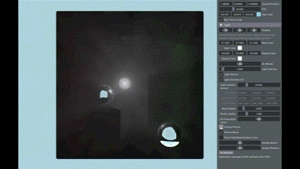

# Disney Photon Beam & Photon Mapping Rendering (DirectX12 with RTX)

This project implements **volumetric participating media rendering** using Disney's **Photon Beam** algorithm and traditional **Photon Mapping**, fully utilizing **DirectX12** and **NVIDIA RTX** features. It forms part of my graphics programming portfolio, showcasing advanced global illumination techniques in real-time rendering.

  

## 📽️ Demo Video and Images
🔗 [YouTube Showcase (DirectX12)](https://youtu.be/Tia85zQ_XLM)

**Beam and Sruface Photon**

**Surface Photon Only**

  

**Beam Only**

**Beam and Photon Sampling Visualization**

**Different Parameter Effects** - Adjusting scattering coefficient, extinct coefficient and HG symmetric factor

## 🔗 Project Links
- **DirectX12 Implementation (This Repository)**  
  https://github.com/donguklim/DirectX12PhotonBeam

- **Vulkan Implementation (Based on NVIDIA Ray-Tracing Tutorial)**  
  https://github.com/donguklim/vk_raytracing_tutorial_KHR/tree/master/photon_beam

---

## ✨ Features

### 🌌 Photon Mapping
- Simulates photon interactions on surfaces via ray tracing.
- Stores radiance sampled from photon hits on surfaces.

### 💫 Photon Beam
- Simulates photon **beams** through participating media like air.
- Samples scattering and extinction based on beam paths and density.
- Produces realistic volumetric lighting effects.

### 🔁 Scattering Modes
| Mode | Scattering Direction |
|------|----------------------|
| Uniform | Evenly scattered in all directions |
| Forward | Scattered near beam’s previous direction |
| Backward | Scattered opposite to the beam’s direction |

### 🌈 Dynamic Light Simulation
- Light reflection is controlled by random seed updates.
- To avoid flickering, linear interpolation blends two seed-based frames.
- Adjusting seed interval simulates underwater wave-like effects.

🎞️ Example of dynamic lighting:  
[Jump to 20:00 in demo video](https://youtu.be/Tia85zQ_XLM?t=1200)

---

## 📚 References
 - ### Photon Mapping
    - Jensen, Henrik. (2001). A Practical Guide to Global Illumination using Photon Maps.
 - ### Photon Beam
    - Derek Nowrouzezahrai, Jared Johnson, Andrew Selle, Dylan Lacewell, Michael Kaschalk, Wojciech Jarosz. A programmable system for artistic volumetric lighting. ACM Transactions on Graphics (Proceedings of SIGGRAPH), 30(4):29:1–29:8, August 2011.
    - Wojciech Jarosz, Derek Nowrouzezahrai, Iman Sadeghi, Henrik Wann Jensen. A comprehensive theory of volumetric radiance estimation using photon points and beams. ACM Transactions on Graphics (Presented at SIGGRAPH), 30(1):5:1–5:19, January 2011.
 - ### BRDF Sampling
    - https://www.astro.umd.edu/~jph/HG_note.pdf    &nbsp; [[pdf file backup]](reference_backup/HG_note.pdf)
    - https://agraphicsguynotes.com/posts/sample_microfacet_brdf/   &nbsp; [[webpage backup as pdf file]](reference_backup/Importance_Sampling_techniques_for_GGX.pdf)
    - https://schuttejoe.github.io/post/ggximportancesamplingpart1/     &nbsp; [[webpage backup as pdf file]](reference_backup/sampling_with_microfacet_brdf.pdf)

## Third Party Libraries 

 - "Introduction to 3D Game Programming with DirectX 12" book - [Sample codes in `Common` folder](https://github.com/d3dcoder/d3d12book/tree/4cfd00afa59210a272f62caf0660478d18b9ffed/Common).
	- [Common/](./Common) - The original codes have been modified.
	
 - [Microsoft Official DirectX header files](https://github.com/microsoft/DirectX-Headers/tree/9ca4839a1b49aeac56c86036212dc035b1cf4a09/include/)
	- [third-party/directx-headers](./third-party/directx-headers)
 - tiny gltf - [`stb_image.h`, `stb_image_write.h`, `json.hpp`, `tiny_gltf.h`](https://github.com/syoyo/tinygltf/tree/aa613a1f572c8b9c676a4c0a1d6e5445bf5760f5)
	- [third-party/tiny-gltf](./third-party/directx-headers)
 - Microsoft DirectX Samples - [DirectXRaytracingHelper.h](https://github.com/microsoft/DirectX-Graphics-Samples/blob/0aa79bad78992da0b6a8279ddb9002c1753cb849/Samples/Desktop/D3D12Raytracing/src/D3D12RaytracingProceduralGeometry/DirectXRaytracingHelper.h)
  [DXSampleHelper.h](https://github.com/microsoft/DirectX-Graphics-Samples/blob/0aa79bad78992da0b6a8279ddb9002c1753cb849/Samples/Desktop/D3D12Raytracing/src/D3D12RaytracingProceduralGeometry/util/DXSampleHelper.h)

	- [third-party/microsoft-directx-graphics-samples](./third-party/microsoft-directx-graphics-samples)

## 📌 Notes
- **Specular surfaces** are handled using plain ray tracing, as photon techniques are insufficient in those cases.
- Parameters such as **light hue, intensity**, and **air murkiness** control the scattering visuals and beam density.

---

## 📁 Related Portfolio
For more rendering and simulation projects, check out my main portfolio repository:  
🔗 [Graphics Portfolio](https://github.com/donguklim/GraphicsPortfolio)

---